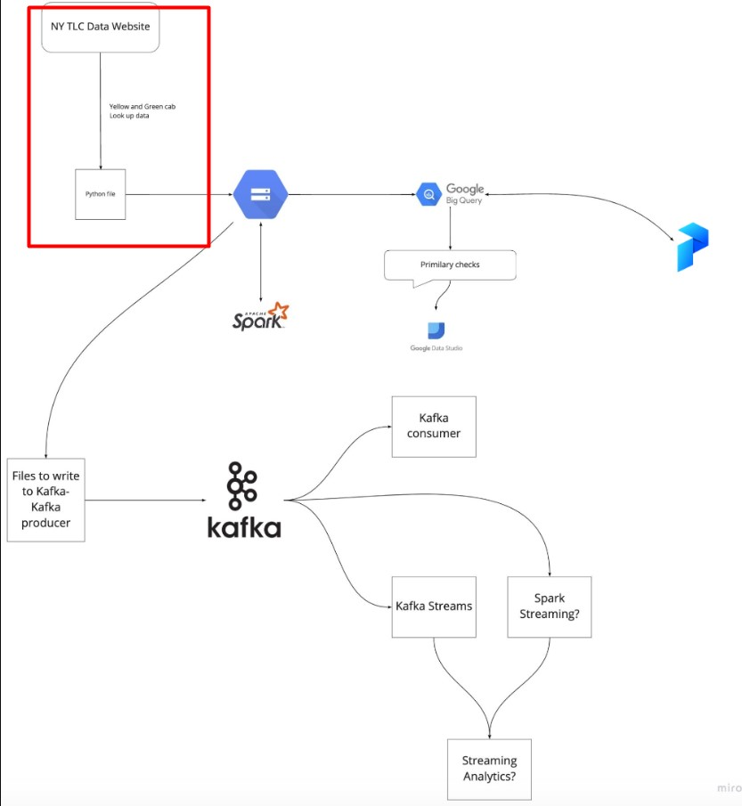

## Related Part in the Project

## Data pipelines

A **data pipeline** is a service that receives data as input and outputs more data. For example, reading a CSV file, transforming the data somehow and storing it as a table in a PostgreSQL database. Becuase of that, we need a postgresql database. We will have it with docker container.

