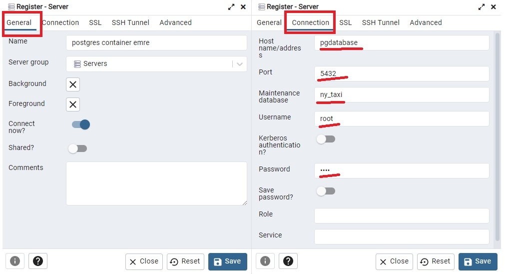

## Related Part in the Project


## Data pipelines (Ingesting NY Taxi CSV Data to Postgres DB)

Our task is to create a data pipeline for this week. A **data pipeline** is an automated system to do an ETL (Extract, Transform, Load) with data. We firstly read CSV files, store the data in a PostgreSQL database (DB) with a convenient schema. We need a postgresql DB. We create a postgres DB in a docker container. And then we explore data with sql commands.

However, **we will not use postgres for the rest of the project**. Instead of storing data in the postgres DB, we transform them into parquet format and store in the google cloud storage (GCS).


## Connecting pgAdmin and Postgres

pgcli is a handy tool for managing postgres DB but it's cumbersome to use. pgAdmin is a web-based tool (GUI) that makes it more convenient to access and manage our DB. We will create also a pgadmin tool in a docker container to access the postgres DB visually from the web broser. 


### Connect the postgres DB from pgadmin




## Ingest CSV data to Postgres DB (Pandas and Sqlalchemy in Python)

- Read CSV files and transform data with Pandas.
- Connect Postgres DB and insert data into DB with Sqlalchemy.


## Installation
- Build and run a docker image to ingest csv files into postgres DB
- Run docker-compose for postgres database and management tool and ingesting data
```
export URL="https://github.com/DataTalksClub/nyc-tlc-data/releases/download/green/green_tripdata_2019-01.csv.gz"
docker-compose up -d
```